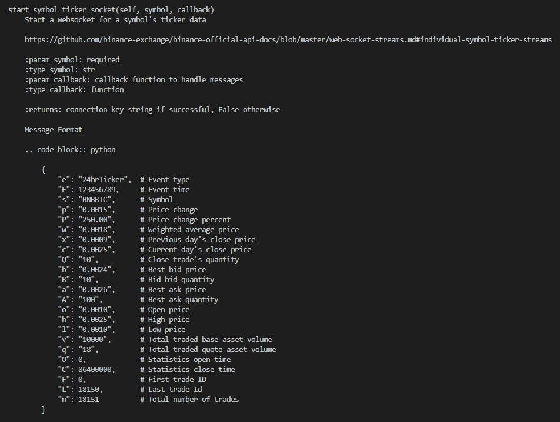
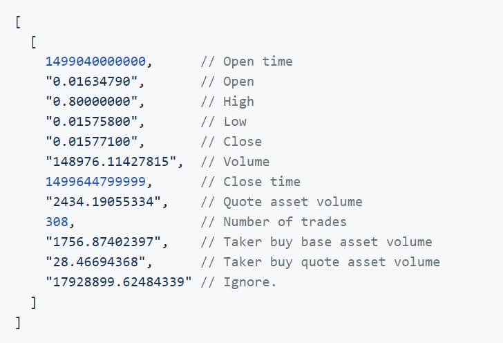

<h1>Binance</h1>

<h4>On this folder ther will be some tests on different aspects of Binance using <b>python-binance</b> library.</h4>

<ul>
    <li><b>binance_websocket</b> it's an ETL using Casandra to save the tickers data that I get with the web socket. <b>img1</b> Shows how is structure of the web socket message </li>
    <li><b>binance_historical_klines</b> It's an analysis on BTCUSDT ticker using Pandas and btalib, I also plot some values with matplotlib <b>img2</b> Shows get_historical_klines response </li>
</ul>

<b>img1</b> 

 
<b>img2</b> 
